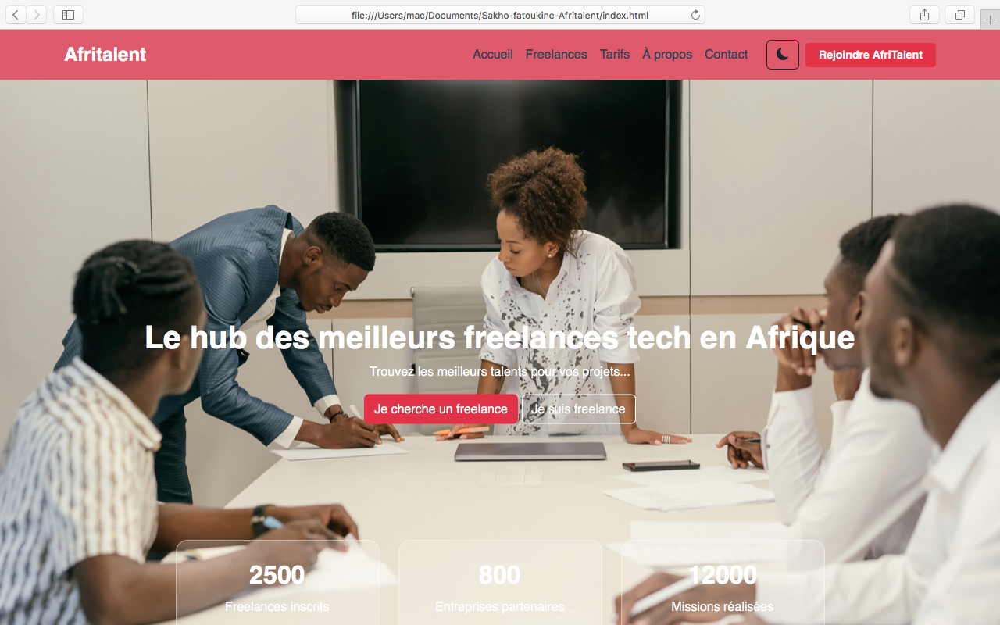

# AfriTalent

**Le hub des meilleurs freelances tech en Afrique**

Projet réalisé par : Fatou kiné sakho
Classe : L1 IAGE-NR
Groupe ISI — Semestre 2

---

## 📋 Description

AfriTalent est le site vitrine d'une plateforme fictive de mise en relation entre freelances tech et entreprises en Afrique. Le site présente la plateforme, ses fonctionnalités, ses tarifs, des profils de freelances, et vise à convaincre les visiteurs (freelances et entreprises) de s'inscrire. Il a été conçu en suivant les tendances web actuelles : design épuré, typographie expressive, mise en page en Bento Grid, accessibilité, et interactivité JavaScript.

---

## 🛠️ Technologies utilisées

- **HTML5** — structure sémantique et accessible
- **CSS3** — Flexbox, Grid, Bento Grid, variables CSS, animations, responsive design
- **Bootstrap 5** — grille, navbar, cards, carousel, accordion, modal
- **JavaScript (vanilla)** — sans framework ni jQuery
- **Google Fonts** — Inter et Poppins
- **Bootstrap Icons**
- **Git & GitHub** — versioning et déploiement via GitHub Pages

---

## ✨ Fonctionnalités principales

- 🌙 **Dark Mode / Light Mode** — bascule sauvegardée dans `localStorage`, persiste entre les pages
- 📊 **Compteurs animés** — statistiques qui s'incrémentent au scroll (`IntersectionObserver`)
- 🎯 **Filtrage dynamique des freelances** — par catégorie et par domaine précis, sans rechargement de page
- ✅ **Validation de formulaire** — champs requis, format email par regex, longueur minimum du message, messages d'erreur personnalisés
- 📱 **Navbar dynamique** — change de style au scroll (ombre, effet shrink)
- ⬆️ **Bouton retour en haut** — apparaît au scroll, remonte en douceur
- 🎬 **Animations au scroll** — sections en fondu (fade-in) à l'entrée dans le viewport
- 📐 **Responsive design** — mobile (375px), tablette (768px), desktop (1200px+)

---

## 📸 Capture d'écran



*(Remplace cette image par une vraie capture de ta page d'accueil, enregistrée dans le dossier `images/` sous le nom `screenshot-home.png`)*

---

## 🚀 Lancer le projet en local

1. Cloner le dépôt :
   ```bash
   git clone https://github.com/fatou-kine-dev/Sakho_fatoukine_Afritalent.git
   ```
2. Ouvrir le dossier du projet
3. Ouvrir `index.html` directement dans un navigateur (double-clic ou clic droit → Ouvrir avec)

Aucune installation ni dépendance n'est nécessaire, le site fonctionne directement en local.

---

## 🌐 Site en ligne

Le site est déployé via GitHub Pages :
**[https://fatou-kine-dev.github.io/Sakho_fatoukine_Afritalent/](https://fatou-kine-dev.github.io/Sakho_fatoukine_Afritalent/)**

---

## 📚 Ressources consultées

- [MDN Web Docs](https://developer.mozilla.org/fr/) — référence HTML, CSS, JavaScript
- [Bootstrap 5 Docs](https://getbootstrap.com/docs/5.3/) — composants et grille
- [Google Fonts](https://fonts.google.com/) — polices Inter et Poppins
- [Bootstrap Icons](https://icons.getbootstrap.com/) — icônes
- [W3C Validator](https://validator.w3.org/) — validation du HTML
- [Unsplash](https://unsplash.com/) — images libres de droits

---

## 📁 Structure du projet

```
Sakho_fatoukine_Afritalent/
├── index.html
├── freelances.html
├── tarifs.html
├── about.html
├── contact.html
├── css/
│   └── styles.css
├── js/
│   └── main.js
├── images/
├── docs/
│   └── Sakho_Fatou_Kine_Presentation.pptx
├── README.md
└── .gitignore
```

---

© 2026 AfriTalent — Projet académique, Groupe ISI